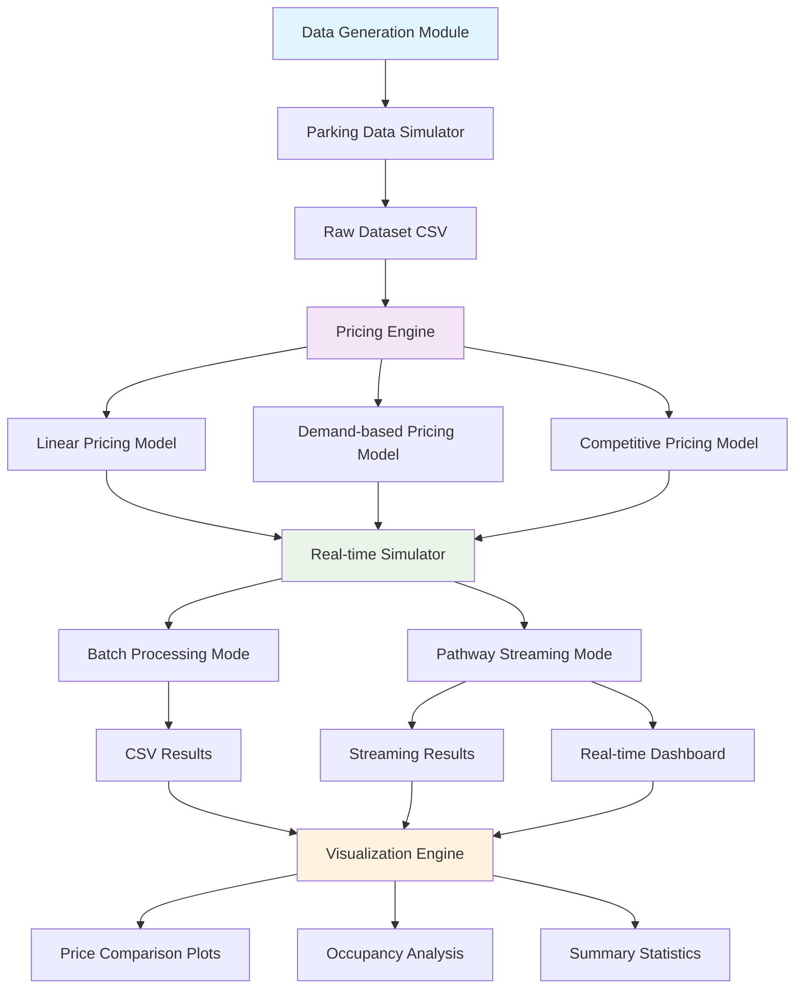

# Capstone_project_SummerAnalytics25
# Dynamic Parking Pricing System

A real-time dynamic pricing system for urban parking lots that uses multiple pricing models to optimize parking space utilization and revenue generation based on demand patterns, occupancy rates, and competitive factors.

## 🚀 Project Overview

This project implements a comprehensive parking pricing simulation system that:
- Generates realistic parking data for 14 parking spaces across 5 days
- Implements three distinct pricing models (Linear, Demand-based, and Competitive)
- Provides real-time pricing updates using streaming data processing
- Visualizes pricing trends and occupancy patterns
- Supports both batch processing and real-time streaming modes

## 🛠️ Tech Stack

### Core Technologies
- **Python 3.8+** - Primary programming language
- **Pandas** - Data manipulation and analysis
- **NumPy** - Numerical computations
- **Pathway** - Real-time streaming data processing
- **Bokeh** - Interactive data visualization

### Libraries & Dependencies
- **datetime** - Time-based calculations
- **dataclasses** - Data structure management
- **math** - Mathematical operations
- **random** - Data generation and simulation
- **typing** - Type hints and annotations

### Development Environment
- **Google Colab** - Recommended execution environment
- **Jupyter Notebook** - Alternative development environment

## 🏗️ Architecture Diagram



## 📋 Project Architecture & Workflow

### 1. Data Generation Layer
The `ParkingDataGenerator` class creates realistic parking scenarios:
- **14 parking spaces** distributed across city-like grid pattern
- **18 time points** per day (8:00 AM to 4:30 PM, 30-minute intervals)
- **5 days** of simulation data
- **Realistic parameters**: occupancy, queue length, traffic levels, vehicle types

### 2. Pricing Models Layer
Three distinct pricing strategies implemented:

#### Linear Pricing Model
- **Formula**: `New Price = Previous Price + (α × Occupancy Rate)`
- **Features**: Simple occupancy-based pricing
- **Use Case**: Basic dynamic pricing implementation

#### Demand-based Pricing Model
- **Formula**: `Demand Score = α×Occupancy + β×Queue - γ×Traffic + δ×Special Day + ε×Vehicle Type`
- **Features**: Multi-factor demand calculation with sigmoid normalization
- **Use Case**: Comprehensive demand-responsive pricing

#### Competitive Pricing Model
- **Features**: Extends demand-based pricing with geographic competition
- **Logic**: Adjusts prices based on nearby competitors' pricing
- **Proximity**: Uses 1km radius for competitor identification

### 3. Simulation Engine
The `ParkingPricingSimulator` orchestrates the entire process:
- **Sequential Processing**: Processes data day-by-day, time-point-by-time-point
- **Real-time Simulation**: Includes configurable delays between updates
- **Price History Tracking**: Maintains pricing state across time periods
- **Multi-model Execution**: Runs all three pricing models simultaneously

### 4. Streaming Processing (Pathway Integration)
Advanced real-time processing capabilities:
- **Pathway Framework**: Handles streaming data ingestion
- **Real-time Updates**: Processes parking data as it arrives
- **Multiple Outputs**: CSV files and JSON streams for different use cases

### 5. Visualization Layer
Comprehensive analysis and monitoring tools:
- **Price Comparison Charts**: Side-by-side model performance
- **Occupancy Correlation**: Relationship between occupancy and pricing
- **Summary Statistics**: Statistical analysis of pricing patterns
- **Real-time Dashboard**: Live monitoring interface

## 🔧 Workflow Process

### Data Flow Pipeline
1. **Initialization**: Set up 14 parking spaces with random but realistic coordinates
2. **Data Generation**: Create 5 days × 18 time points × 14 spaces = 1,260 data records
3. **Pricing Calculation**: Apply all three models to each data point
4. **Real-time Simulation**: Process data sequentially with time delays
5. **Results Storage**: Save outputs to CSV files for analysis
6. **Visualization**: Generate interactive charts and dashboards

### Execution Modes
- **Standard Mode**: Batch processing with visualization
- **Pathway Mode**: Real-time streaming with live updates
- **Dashboard Mode**: Interactive monitoring interface

## 📊 Key Features

### Dynamic Pricing Capabilities
- **Price Bounds**: 0.5x to 2.0x base price ($5-$20 range)
- **Real-time Updates**: Prices adjust every 30 minutes
- **Multiple Factors**: Occupancy, queue length, traffic, special events
- **Competitive Intelligence**: Geographic proximity-based pricing

### Data Analytics
- **Statistical Analysis**: Mean, min, max, standard deviation
- **Trend Analysis**: Price volatility and pattern identification
- **Occupancy Correlation**: Relationship analysis between utilization and pricing
- **Model Comparison**: Performance metrics across different approaches

### Visualization Features
- **Interactive Charts**: Bokeh-powered dynamic visualizations
- **Multi-space Monitoring**: Track up to 6 parking spaces simultaneously
- **Real-time Updates**: Live dashboard with streaming data
- **Export Capabilities**: Save results in multiple formats

## 🚀 Getting Started

### Prerequisites
```bash
# Install required packages in Google Colab
!pip install pathway-python bokeh
```

### Execution Options

**Option 1: Standard Simulation**
```python
# Set in main execution
use_pathway = False
```

**Option 2: Real-time Streaming**
```python
# Set in main execution
use_pathway = True
```

### Output Files
- `parking_dataset.csv` - Raw parking data
- `pricing_results.csv` - Batch processing results
- `pathway_pricing_results.csv` - Streaming results
- `pathway_pricing_stream.jsonl` - Real-time stream data

## 📈 Results & Analysis

The system generates comprehensive analytics including:
- **Average pricing** across different models
- **Price volatility** measurements
- **Occupancy rate correlations**
- **Competitive pricing effectiveness**
- **Time-based demand patterns**

## 🔮 Future Enhancements

- Integration with real parking sensor data
- Machine learning-based demand prediction
- Mobile app for real-time price notifications
- API endpoints for third-party integrations
- Advanced competitive intelligence features

## 📝 Project Structure

```
├── README.md
└── dynamic_parking_pricing.ipynb
```

## 🤝 Contributing

This project is part of the Summer Analytics 2025 Capstone Project. Feel free to fork, modify, and enhance the codebase for your specific use cases.

---

*Developed as part of Summer Analytics 2025 Capstone Project*
